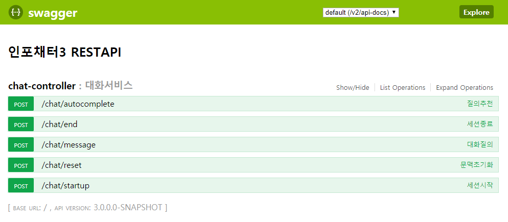

# 인포채터3 REST API

이 문서는 인포채터 API 연동규격서입니다.

## 설치방법

1. WAS(Tomcat 등)에 REST API WAR 를 배포합니다.
2. `WEB-INF/classes/config/application.properties` 엔진 접속정보를 수정하고 통신을 이상유무를 확인합니다.

## 설정파일 <small>(application.properties)</small>

* app.engine.host: 인포채터 엔진 IP (기본값: 127.0.0.1)
* app.engine.port: 인포채터 엔진 Port (기본값: 7055)
* app.engine.timeout: 인포채터 엔진 Timeout (기본값: 15000ms)

## 기능

* RestAPI 에서 제공하는 기능목록입니다.
* 상세정보는 Test UI 에서 확인합니다.
* 목록
  * 세션시작: 세션아이디 발급 및 인사말 조회
  * 자동완성: 자동완성 제공
  * 대화질의: 질의/응답
  * 문맥초기화: 세션에 저장된 문맥정보 초기화
  * 세션종료: 세션아이디 삭제 및 맺음말 조회

## 오류코드

오류 발생 시 단일오류코드(9999)를 응답합니다.

| HTTP 상태코드 | Code | 설명 |
| -- | -- | -- |
| 500 | 0511 | NLU 과정 오류 |
| 500 | 0512 | 대화상태 과정 오류 |
| 500 | 0513 | 답변생성 과정 오류 |
| 503 | 0503 | 서비스 사용 불가 |
| 500 | 9999 | 오류 발생 |

### 오류메시지 규격

```json
{
    "code": "9999",
    "message": "오류 발생"
}
```

## Test UI

Swagger 이용한 Test UI 제공하여 요청/응답 규격 및 바로 테스트가 가능합니다.

* URL: {RESTAPI_URL}/swagger-ui.html


